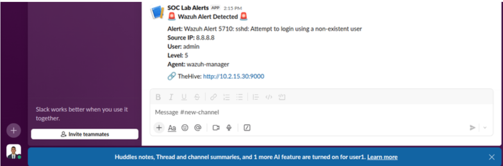
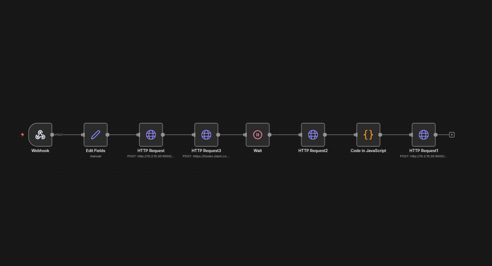

# 🛡️ SOC Automation Lab - Enterprise Security Operations Center


> **A comprehensive Security Operations Center lab demonstrating automated threat detection, orchestration, enrichment, and response capabilities using enterprise-grade security tools.**

---

## 🎯 Project Vision

This project implements a complete SOC automation pipeline capable of:
- **Detecting** threats from both endpoint (EDR) and network (NSM) perspectives
- **Orchestrating** automated response workflows with SOAR
- **Enriching** indicators of compromise with threat intelligence
- **Enabling** analyst decision-making with contextual information
- **Responding** automatically to confirmed threats with endpoint isolation

**⚠️ Project Status**: Core detection and enrichment pipeline fully operational. Advanced automation features (decision trees, active response) documented but not yet implemented due to time constraints. See [PROJECT_STATUS.md](PROJECT_STATUS.md) for detailed implementation status.

---

## 📐 Architecture


### System Components

| Component | Role | IP Address | Status |
|-----------|------|------------|--------|
| **Wazuh Manager** | SIEM/EDR | 10.2.15.20 | ✅ Operational |
| **Security Onion** | Network Security Monitoring | 10.2.15.10 | ✅ Deployed |
| **TheHive** | Incident Management | 10.2.15.30:9000 | ✅ Operational |
| **Cortex** | Threat Intelligence | 10.2.15.30:9001 | ✅ Operational |
| **n8n** | SOAR Orchestration | 10.2.15.40:5678 | ✅ Operational |
| **Windows 10** | Victim Endpoint | 10.2.15.50 | ✅ Operational |
| **Kali Linux** | Attack Platform | 10.2.15.60 | ✅ Operational |

---

## 🚀 Features

### ✅ **Implemented**
- [x] Automated alert detection with Wazuh EDR
- [x] SOAR orchestration with n8n workflows
- [x] Threat intelligence enrichment (VirusTotal, AbuseIPDB, MaxMind GeoIP)
- [x] Incident case management with TheHive
- [x] Real-time Slack notifications
- [x] SSH brute force detection rules
- [x] Automated observable extraction from alerts
- [x] Docker-based Cortex analyzers

### 🚧 **Documented but Not Implemented**
- [ ] Network Security Monitoring with Security Onion integration
- [ ] Analyst decision prompts with interactive workflows
- [ ] Automated endpoint isolation with Wazuh Active Response
- [ ] Email notification channels
- [ ] Conditional response logic based on threat severity
- [ ] Correlation between network and endpoint events

See [ROADMAP.md](ROADMAP.md) for implementation plans.

---

## 🔄 Workflow Overview

### Current Implementation

```
1. Attack Detection
   └─> Kali Linux → Windows 10 (SSH brute force attack)
   
2. Alert Generation
   └─> Wazuh → n8n Webhook
   
3. Case Creation
   └─> n8n → TheHive (with observables)
   
4. Threat Enrichment
   └─> Cortex Analyzers (VirusTotal, AbuseIPDB, MaxMind)
   
5. Notification
   └─> Slack (formatted alert details + TheHive link)
```

### Complete Vision

The complete architecture includes analyst decision prompts, conditional workflows, and automated active response. See [ARCHITECTURE.md](ARCHITECTURE.md) for the full data flow.

---

## 🛠️ Tech Stack

**Security Tools**:
- **Wazuh 4.x** - SIEM/EDR for endpoint monitoring
- **Security Onion** - Network Security Monitoring (Zeek, Suricata, Elasticsearch)
- **TheHive 4.1.24** - Security Incident Response Platform
- **Cortex 3.1.8** - Observable Analysis and Active Response Engine
- **n8n** - Workflow automation and SOAR platform

**Infrastructure**:
- **VirtualBox 6.1** - Virtualization platform
- **Ubuntu 20.04** - Host operating system
- **6 Virtual Machines** on isolated NAT network (10.2.15.0/24)

**Threat Intelligence Sources**:
- VirusTotal API
- AbuseIPDB API
- MaxMind GeoIP Database

**Communication**:
- Slack (Real-time alerts)
- Email (Documented, not implemented)

---

## 📚 Documentation

| Document | Description |
|----------|-------------|
| [PROJECT_STATUS.md](PROJECT_STATUS.md) | Current implementation status vs vision |
| [ARCHITECTURE.md](ARCHITECTURE.md) | Detailed architecture and data flows |
| [SETUP_GUIDE.md](SETUP_GUIDE.md) | Complete installation and configuration guide |
| [TROUBLESHOOTING.md](TROUBLESHOOTING.md) | Common issues and solutions |
| [ROADMAP.md](ROADMAP.md) | Future implementation plans |

**Component Guides**:
- [Infrastructure Setup](docs/01-infrastructure.md)
- [Wazuh Configuration](docs/02-wazuh-setup.md)
- [TheHive & Cortex Setup](docs/03-thehive-cortex.md)
- [n8n Workflows](docs/04-n8n-workflows.md)
- [Security Onion Integration](docs/05-security-onion.md)
- [Detection Rules](docs/06-detection-rules.md)
- [Active Response Configuration](docs/07-active-response.md)
- [Decision Tree Implementation](docs/08-decision-tree.md)
- [Attack Scenarios](docs/09-use-cases.md)

---

## 📸 Screenshots

### Wazuh Alert Detection

*TheHive case automatically created from Wazuh alert with observables*

### Threat Intelligence Enrichment

*Cortex analyzers enriching IP observables with VirusTotal, AbuseIPDB, and MaxMind GeoIP*

### Real-time Notifications

*Automated Slack notifications with alert details and TheHive link*

### SOAR Workflow

*n8n workflow orchestrating the detection-to-response pipeline*

[See more screenshots in images/](images/)

---

## 🎓 Learning Outcomes

This project demonstrates proficiency in:

### Technical Skills
- **SIEM/EDR Configuration**: Rule writing, log analysis, agent deployment
- **SOAR Development**: Workflow design, API integration, data transformation
- **Threat Intelligence**: IOC enrichment, reputation scoring, geolocation
- **Incident Response**: Case management, observable tracking, alert triage
- **Security Tool Integration**: Multi-platform API interaction, authentication flows
- **Containerization**: Docker for security tools, volume management, troubleshooting
- **Python Scripting**: Custom integrations, JSON manipulation, API clients
- **Network Security**: Traffic analysis, protocol inspection (foundational)

### Professional Skills
- **Systematic Troubleshooting**: Root cause analysis, debugging methodology
- **Technical Documentation**: Architecture diagrams, setup guides, knowledge transfer
- **Project Management**: Prioritization under time constraints, MVP delivery
- **Security Operations**: Alert handling, enrichment workflows, analyst workflows

### Notable Technical Challenges Solved

1. **Docker Snap Confinement Issue** (4 hours debugging)
   - **Problem**: Cortex analyzers failing with "worker not found" errors
   - **Root Cause**: Docker Snap confinement preventing access to `/tmp`
   - **Solution**: Reconfigured job directory to `/home/thehive/cortex-jobs` with proper permissions
   - **Learning**: Deep understanding of Docker security boundaries and Snap isolation

2. **JSONPath Data Extraction in n8n**
   - **Problem**: Observables created with "N/A" values instead of actual IPs
   - **Root Cause**: Incorrect JSONPath expressions (`$json.sourceIP` vs `$json.data.srcip`)
   - **Solution**: Corrected field mapping based on Wazuh alert structure
   - **Learning**: Importance of understanding source data schemas

3. **Python Library Compatibility**
   - **Problem**: TheHive API integration failures
   - **Root Cause**: Using thehive4py 2.x with TheHive 4.x (incompatible versions)
   - **Solution**: Downgraded to thehive4py 1.8.1 for TheHive 4.x compatibility
   - **Learning**: Version compatibility verification is critical

---

## 🚀 Quick Start

```bash
# Clone the repository
git clone https://github.com/Ayanoh/SOC-Automation-Lab.git
cd SOC-Automation-Lab

# See detailed setup instructions
cat SETUP_GUIDE.md
```

**Prerequisites**:
- Ubuntu 20.04+ host with **minimum 48GB RAM** (64GB recommended)
- VirtualBox 6.1+
- Internet connection for package installation and threat intelligence APIs
- API keys for VirusTotal, AbuseIPDB (free tier available)

**Estimated Setup Time**: 8-12 hours for complete deployment

---

## 🐛 Known Issues & Limitations

### Current Limitations

1. **Security Onion**: Deployed but not integrated into SOAR workflows
   - Network alerts not forwarded to TheHive
   - No correlation between network and endpoint events
   - **Workaround**: Use Security Onion interface for manual network analysis

2. **Cortex Automation**: Enrichment triggered manually from TheHive
   - n8n doesn't automatically trigger Cortex analyzers
   - **Workaround**: Analyst manually runs analyzers after case creation

3. **Decision Logic**: No interactive analyst prompts
   - No automated Yes/No decision workflows
   - **Workaround**: Manual case handling in TheHive

4. **Active Response**: Not implemented
   - No automated endpoint isolation
   - **Workaround**: Manual firewall configuration if needed

See [TROUBLESHOOTING.md](TROUBLESHOOTING.md) for detailed technical issues and solutions.

---

## 🗺️ Roadmap

See [ROADMAP.md](ROADMAP.md) for detailed implementation plans.

### Priority 1 (Next Phase)
- [ ] Implement analyst decision prompt system in Slack
- [ ] Configure and test Wazuh Active Response scripts
- [ ] Complete Security Onion → n8n → TheHive integration
- [ ] Automate Cortex enrichment from n8n workflows

### Priority 2 (Future Enhancements)
- [ ] Add email notification channel
- [ ] Implement conditional response logic based on threat severity
- [ ] Expand detection rules (malware, privilege escalation, lateral movement)
- [ ] Add more attack scenarios and use cases
- [ ] Create dashboard for SOC metrics and KPIs

---

## 📊 Project Metrics

- **Development Time**: ~3 months (part-time)
- **Virtual Machines**: 6 systems
- **APIs Integrated**: 5 (Wazuh, TheHive, Cortex, Slack, n8n)
- **Configuration Files**: 12+
- **Lines of Code**: ~500 (Python, Bash, JSON)
- **Documentation Pages**: 15+
- **Major Issues Debugged**: 8
- **Screenshot Evidence**: 10+

---

## 👤 Author

**Oussama EL Maskaoui**  
Cybersecurity Engineering Student | Networks & Cybersecurity Specialization  
École Mohammadia d'Ingénieurs (EMI)

- 🔗 **LinkedIn**: [linkedin.com/in/oussama-el-maskaoui](https://www.linkedin.com/in/oussama-el-maskaoui/)
- 🐙 **GitHub**: [github.com/Ayanoh](https://github.com/Ayanoh/)
- 📧 **Email**: [oussama.elmaskaoui@gmail.com](mailto:oussama.elmaskaoui@gmail.com)

---

## 📄 License

This project is for **educational and portfolio purposes**. Feel free to use it as a learning resource or template for your own SOC lab.

---

## 🙏 Acknowledgments

- **Wazuh** community for the comprehensive SIEM/EDR platform
- **TheHive Project** for the open-source Security Incident Response Platform
- **n8n** community for the powerful workflow automation engine
- **Security Onion** team for the all-in-one network security monitoring solution
- **Cortex** project for observable analysis capabilities

Special thanks to the cybersecurity community for sharing knowledge and best practices.

---

## ⚠️ Disclaimer

This lab environment is for **educational purposes only**. 

- Do **NOT** use these techniques or configurations in production environments without proper authorization and thorough testing
- All attacks demonstrated are simulated in an isolated environment
- No real malware or production systems are involved
- API keys and credentials shown in documentation are examples only

**Unauthorized testing on systems you don't own is illegal.**

---

## 🔗 Related Resources

- [Wazuh Documentation](https://documentation.wazuh.com/)
- [TheHive Documentation](https://docs.thehive-project.org/)
- [n8n Documentation](https://docs.n8n.io/)
- [Security Onion Documentation](https://securityonionsolutions.com/software)
- [MITRE ATT&CK Framework](https://attack.mitre.org/)

---

**⭐ If you find this project helpful, please consider giving it a star on GitHub!**
